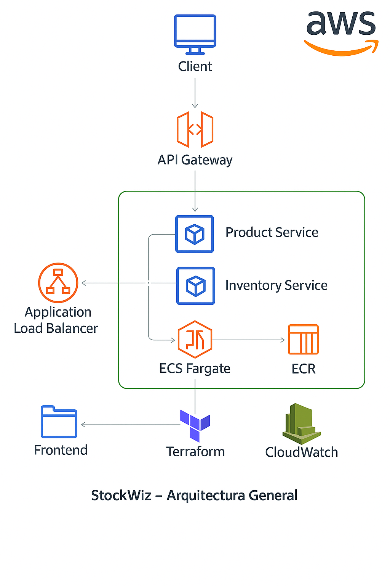

# StockWiz – Plataforma de Microservicios con DevOps

StockWiz es una aplicación de e-commerce basada en microservicios (API Gateway, Product Service e Inventory Service).
Implementa prácticas de DevOps como CI/CD, pruebas automatizadas, infraestructura como código y despliegue en AWS ECS Fargate.

Este documento contiene las instrucciones necesarias para ejecutar, desplegar y configurar el proyecto.

## 1. Estructura del Proyecto

```
StockWiz/
├── api-gateway/          # API Gateway (Go)
├── product-service/      # Product Service (FastAPI)
├── inventory-service/    # Inventory Service (Go)
├── frontend/             # Sitio estático (HTML/CSS/JS)
├── infra/                # Infraestructura como Código (Terraform)
├── testing/              # Pruebas de carga (k6)
├── deploy_all.sh         # Script para publicar imágenes a ECR
└── README.md             # Documentación del proyecto
```

## 2. Requisitos Previos

- AWS CLI configurado  
- Terraform v1.3+  
- Docker y Docker Compose  
- Cuenta de AWS con permisos para ECS, ECR, IAM, CloudWatch, S3  
- Git  

## 3. Arquitectura del Sistema




## 4. Ejecución en Local

```
docker-compose up --build
```

Endpoints localmente:

- API Gateway: http://localhost:8000/api  
- Product Service: http://localhost:8001/products  
- Inventory Service: http://localhost:8002/inventory  
- Frontend: abrir frontend/index.html  

## 5. Pipeline CI/CD
```
             ┌──────────────────────────────┐
             │           Developer           │
             └───────────────┬──────────────┘
                             │  (git push)
                    ┌────────▼────────┐
                    │   DEVELOP branch │
                    └────────┬────────┘
                             │ Trigger CI DEV
                             ▼
                ┌────────────────────────────┐
                │   CI DEV - Sonar + Build   │
                └───────────┬────────────────┘
                            │ PR aprobado
                    ┌───────▼────────┐
                    │ release/test    │
                    └───────┬────────┘
                            │ Trigger CI TEST
                            ▼
               ┌─────────────────────────────┐
               │   CI TEST - Build + K6      │
               └──────────┬──────────────────┘
                           │ Tag de release
                   ┌──────▼──────────┐
                   │      main       │
                   └──────┬──────────┘
                          │ Trigger CD PROD
                          ▼
           ┌────────────────────────────────────┐
           │  CD PROD - Build + Deploy ECS       │
           └─────────────────────────────────────┘

```

### DEV
- Push a develop  
- Build, SonarCloud, k6  

### TEST
- Merge develop → release/test  
- Reejecuta k6  

### PROD
- Merge release/test → main  
- Publica imágenes y despliega  

## 6. Infraestructura como Código

```
cd infra
terraform init
terraform apply
```

Outputs importantes: ALB DNS, ECR URLs, ECS Cluster.

## 7. Publicación de Imágenes en ECR

```
./deploy_all.sh
```

## 8. Despliegue ECS

1. Terraform  
2. deploy_all.sh  
3. Forzar nuevo deploy en ECS  

## 9. Testing y Calidad

```
k6 run testing/loadtest.js
```

SonarCloud integrado en CI.

## 10. Frontend en S3

```
aws s3 cp frontend/index.html s3://stockwiz-frontend-mateoespinosa/index.html
aws s3 sync frontend/ s3://stockwiz-frontend-mateoespinosa/
```

## 11. Estrategia Git

- main  
- release/test  
- develop  
- feature/*  

## 12. Observabilidad

- Dashboard CloudWatch  
- Alarmas  
- Logs ECS  

## 13. Decisiones de Diseño

- ECS Fargate  
- Terraform  
- GitHub Actions  
- S3  
- API Gateway propio  

## 14. Acceso a la aplicación (S3)

```
http://stockwiz-frontend-mateoespinosa.s3-website-us-east-1.amazonaws.com/
```

